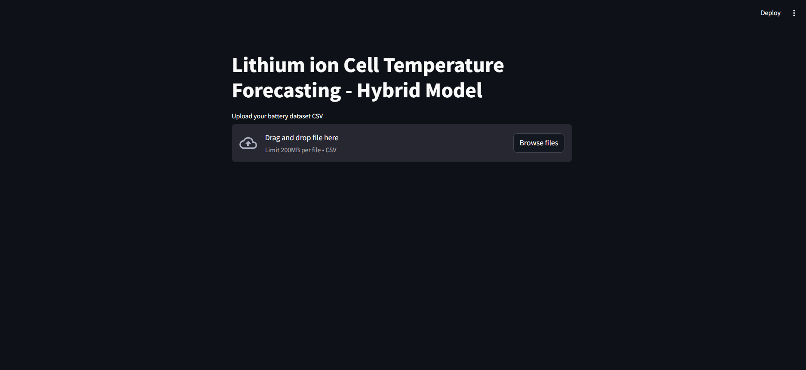
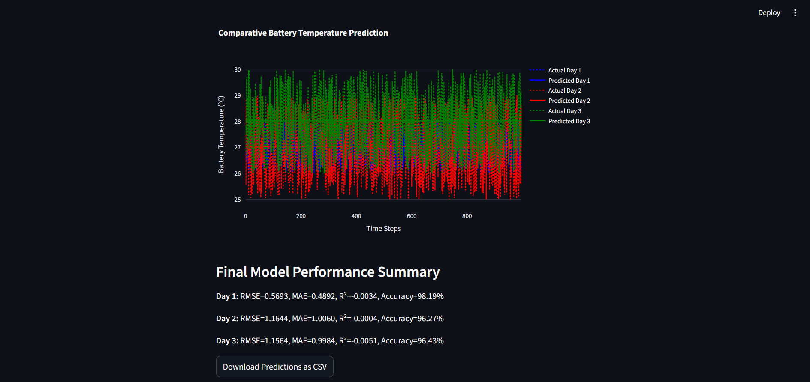
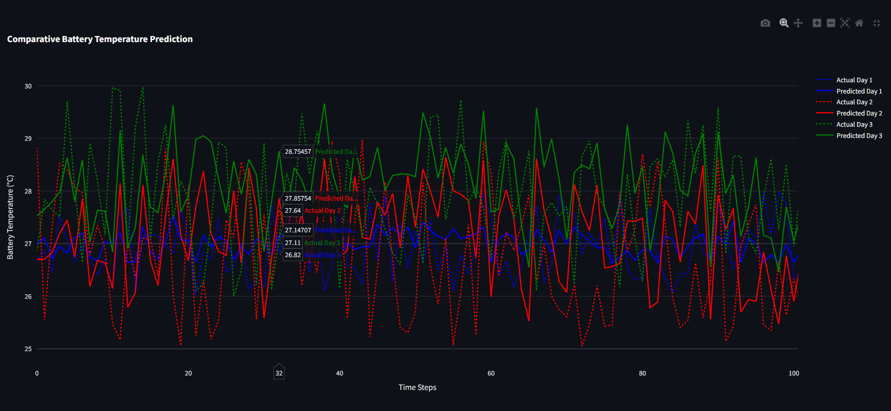

# 🔋 Lithium-ion Battery Temperature Forecasting  
*A Hybrid TCN-Transformer based Deep Learning Application using Streamlit*

---

## 📌 Overview

This project presents a **Streamlit-based web application** for forecasting the **battery temperature** of **Lithium-ion cells** over three future days (Day 1, Day 2, Day 3) using a **hybrid Temporal Convolutional Network (TCN)** and **Transformer Encoder** architecture. It takes real-world or simulated battery parameter logs as input and predicts temperature behavior using a time-series model that combines the strengths of local temporal modeling (TCN) and long-range dependency modeling (Transformer). A powerful time-series forecasting system for predicting the future thermal behavior of lithium-ion batteries over multiple days using a hybrid deep learning model that combines Temporal Convolutional Networks (TCN) and Transformer encoders. 

Built with Streamlit, the interactive web interface allows users to upload historical battery datasets and visualize day-wise predicted vs. actual battery temperatures, backed by detailed metrics and downloadable results. The system is designed to assist in battery thermal management, early overheating detection, and health diagnostics.

---

## 🚀 Features

- 📁 Upload your own CSV dataset with timestamped battery features  
- 🤖 Train a deep learning hybrid model (TCN + Transformer) directly in the app  
- 📉 Visualize predictions vs. actual values for all 3 forecast days  
- 📊 Download prediction results as CSV  
- 📈 View training and validation loss graphs for transparency  
- ✅ Model evaluation metrics: RMSE, MAE, R², Accuracy  

---

## 🧠 Model Architecture

- **Temporal Convolutional Network (TCN)** for sequential feature learning  
- **Transformer Encoder** with Multi-Head Attention for capturing long-range dependencies  
- Fully Connected Layers for final temperature regression

---

## 📂 Input Dataset Format

The uploaded `.csv` should contain the following columns:

| Column Name                          | Description                                   |
|-------------------------------------|-----------------------------------------------|
| `Timestamp`                         | Time of record (used as index)                |
| `Ambient Temp (°C)`                 | Surrounding temperature                       |
| `Initial Temp (°C)`                 | Initial battery temperature                   |
| `SOC (%)`                           | State of Charge (%)                           |
| `Time Since Last Discharge (hrs)`   | Time since battery was last discharged        |
| `Actual Battery Temp Day 1 (°C)`    | Ground truth temp for Day 1 forecast          |
| `Actual Battery Temp Day 2 (°C)`    | Ground truth temp for Day 2 forecast          |
| `Actual Battery Temp Day 3 (°C)`    | Ground truth temp for Day 3 forecast          |

---
## Sample Outputs

### File drop web
<p align="center">
  
</p>
### Comparative Temperature Forecast
<p align="center">
  
</p>
<p align="center">
  
</p>

## 🛠 Installation

### Prerequisites

- Python 3.8+
- pip

### How to Run

```bash

# 1. Clone this repo
git clone https://github.com/Dharnu04/Temperature-Forecasting-of-EV-Battery-using-TCN.git
cd Temperature-Forecasting-of-EV-Battery-using-TCN
# 2. Install dependencies
pip install -r requirements.txt

# 3. Launch the app
streamlit run TCN.py
